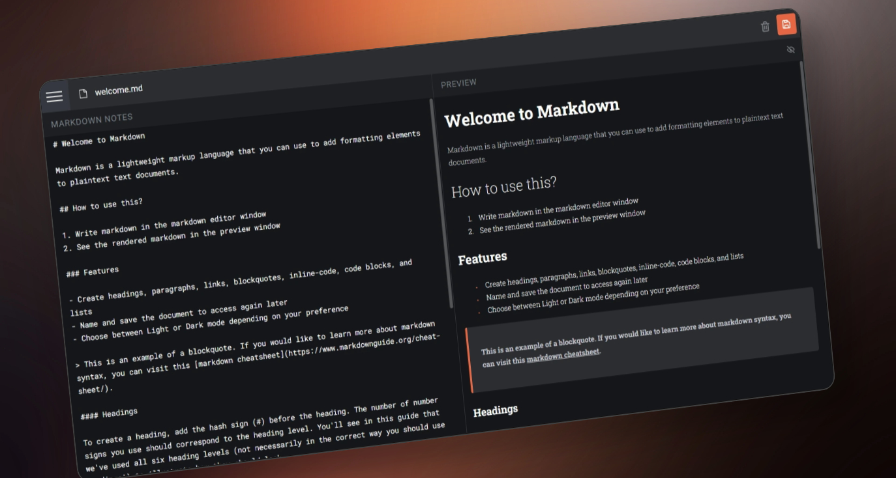

# Markdown Notes



Markdown Notes es una aplicación web que permite escribir, editar y guardar notas en formato **Markdown**.  

Este proyecto fue desarrollado como parte de mi aprendizaje en **Angular**, con el objetivo de poner a prueba mis habilidades en el framework y mejorar mi conocimiento en el desarrollo de aplicaciones web.  

## Tecnologías utilizadas  
- **Angular** (Framework principal)  
- **TypeScript** (Tipado estático y mejores prácticas)  
- **GitHub Pages** (Despliegue del proyecto)  

## Características  
✅ Editor de texto con soporte para Markdown  
✅ Vista previa en tiempo real  
✅ Almacenamiento local para guardar notas  
✅ Interfaz minimalista y fácil de usar  

## Demo  
Puedes probar la aplicación en el siguiente enlace:  
[Markdown Notes en GitHub Pages](https://axelestrada.github.io/markdown-notes)  

## Instalación y ejecución  
Si deseas ejecutar el proyecto en tu entorno local, sigue estos pasos:  

```sh
git clone https://github.com/axelestrada/markdown-notes.git
cd markdown-notes
npm install
ng serve
```

Luego, abre tu navegador en http://localhost:4200.
